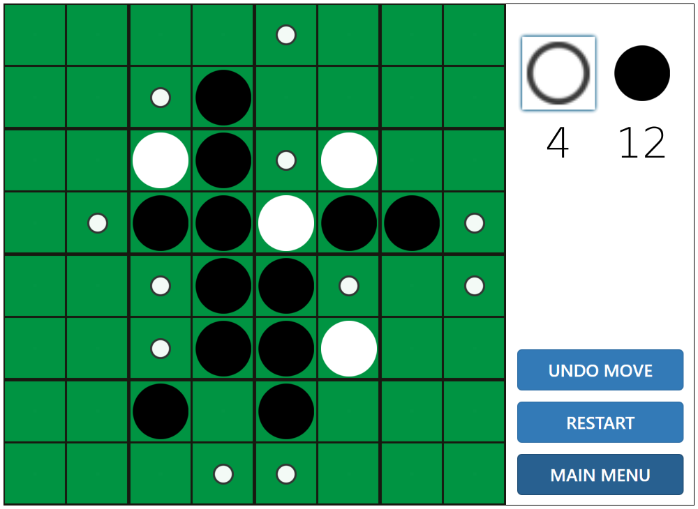

# Reversi (_aka._ Othello)

> This project is a Reversi (Othello) board game written in Racket language.

You may want to check out the [Proposed Project](proposed_project.pdf) file for more details. It was made as a final project of the CS154 (Abstractions and Paradigms in Programming - Lab) course at IIT Bombay.

## Getting Started

Follow the instructions below to get our project running on your local machine.

1. Make sure your machine has the required prequisite softwares and tools.
2. Install the District Pro font by using the `DistProTh.otf` font in the same directory for better visual fonts.
4. To play the multiplayer game, one of the two players should be a host, and the host should click the 'RUN' in the pop-up of Multiplayer-LAN before entering the IP-address and Name. The IP-address should correspond to that of host. Once, you are ready, the host should 'FIRST' press 'PLAY' only after which the next player should press the 'PLAY' button. The grid-size is automatically decided by the host settings.
5. To run the game, run the `game.rkt` file! Yaay. Enjoy!

### Prerequisites

* Racket - Install Racket from the [official website](https://racket-lang.org/).
* RSound - Install the RSound package using the `raco pkg install rsound` command.

## Screenshots

			|  
:------------------------------------------------------:|:------------------------------------------------------:
	|  

## Authors

* **Vamsi Krishna Reddy Satti** - *Initial work* - [vamsi3](https://github.com/vamsi3)
* Yaswanth Kumar Orru
* Sathvik Reddy Kollu

## License

This project is licensed under the MIT License - see the [LICENSE](LICENSE) file for details.
